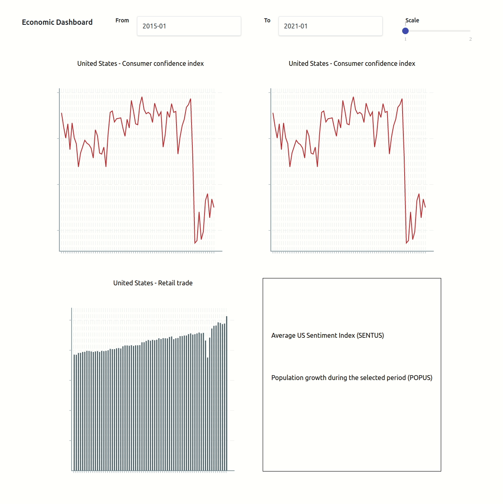

# Economic Dashboard - Programming Task - PWC

This project was bootstrapped with [Next.js](https://nextjs.org/docs/getting-started).

## The task

The task is to create the dashboard screen given via the document and implement all the required logics and interfaces.

## Tech

- ReactJS
- TypeScript
- [Next.js](https://nextjs.org/docs/getting-started)
- ES6
- [Tailwind CSS](https://tailwindcss.com/docs/guides/nextjs)
- [ESLint](https://eslint.org/)
- [Prettier](https://prettier.io/)
- [Husky](https://typicode.github.io/husky/#/)
- [Storybook](https://storybook.js.org/docs/react/get-started/introduction)

## Other

- [Victory Charts](https://formidable.com/open-source/victory/docs/)
- [bignumber.js](https://mikemcl.github.io/bignumber.js/)
- [react-input-range](https://yarnpkg.com/package/react-input-range)
- [React Date Picker](https://www.npmjs.com/package/react-datepicker)

## Demo (GIF)



## Installation

Developed using: `Node Hydrogen (lts/hydrogen)` and `yarn`.

`.nvmrc` - Which version of Node is used

`.npmrc` - Which package manager is used

Additional setting in `package.json` to restrict to `yarn`

```
"engines": {
    "node": ">=18.0.0",
    "yarn": ">=1.22.0",
    "npm": "please-use-yarn"
  }
```

To install the project,

Clone the repository and run,

```sh
cd
next-dashboard
yarn install
```

Run

```sh
yarn dev
```

Test Eslint

```
yarn lint
```

Storybook

```sh
yarn storybook
```

## Instructions

- Open the url in the browser after runing the `yarn dev`.
- `http://localhost:3000`
- The dashboard will be displayed in the browser with five main display sections.
- There is a demo file ( `economic-dashboard-demo.gif` ) available in the `public/demo` directory.

## Assumptions

- No axis labels/values displayed on the charts.
- The API returns standard data format.

## Improvements

- Install `Jest` and write unit tests to cover all the logics/components.
- Implement storybook for all the components.
